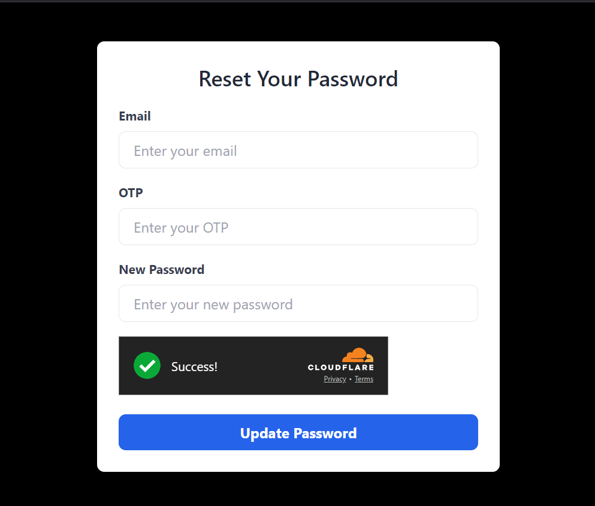

# DoS and DDoS Prevention Using Rate Limiting and CAPTCHA

This project demonstrates how to mitigate **Denial of Service (DoS)** and **Distributed Denial of Service (DDoS)** attacks by implementing **Rate Limiting** and **CAPTCHA** verification. It features a simple Express-based server with rate limiting and CAPTCHA verification using Cloudflare Turnstile.

## Features

- **Rate Limiting**: Limits the number of requests that can be made by a user in a given time frame, preventing abuse and mitigating DOS/DDOS attacks.
- **CAPTCHA Protection**: Uses Cloudflare Turnstile to verify that requests are made by humans, not bots, before sensitive operations (like password reset) are allowed.

## Technologies Used

- **Node.js**: JavaScript runtime for server-side code execution.
- **Express**: Web framework for Node.js for handling HTTP requests.
- **Rate Limiting**: Implemented with the `express-rate-limit` package.
- **Cloudflare Turnstile**: A CAPTCHA alternative to verify that requests are made by humans.
- **FormData**: For sending form data in the CAPTCHA verification request.

